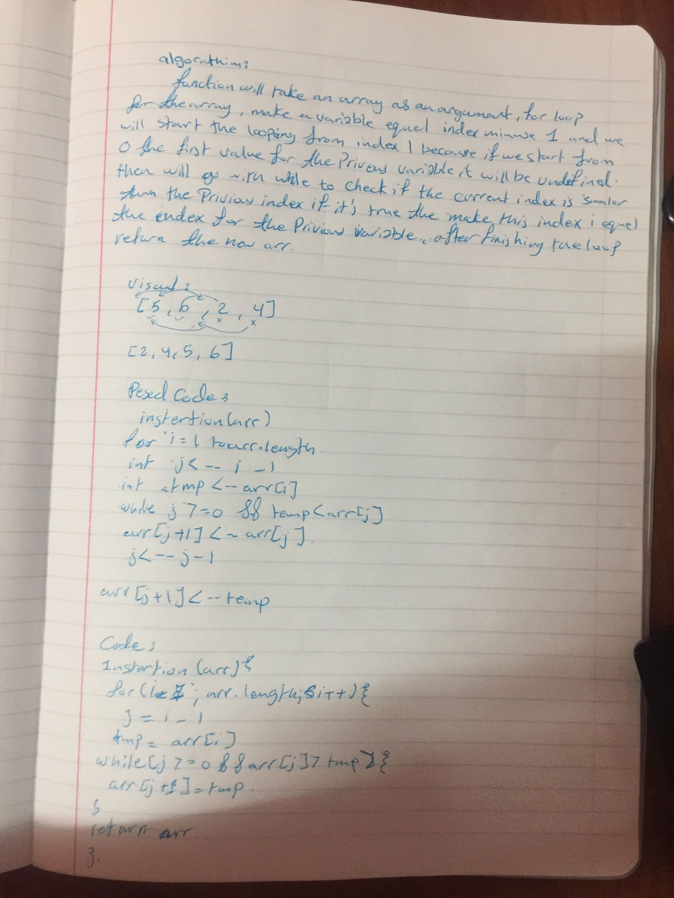

# Insertion Sort
Review the pseudocode, then trace the algorithm by stepping through the process with the provided sample array.
```
  InsertionSort(int[] arr)
  
    FOR i = 1 to arr.length
    
      int j <-- i - 1
      int temp <-- arr[i]
      
      WHILE j >= 0 AND temp < arr[j]
        arr[j + 1] <-- arr[j]
        j <-- j - 1
        
      arr[j + 1] <-- temp
```

## Challenge
writing a function takes an array as an argument. Without utilizing any of the built-in methods available, return an array with elements in insertion sorted order.

## Approach & Efficiency
Time: O(n^2)
Space: O(1)

## Solution
