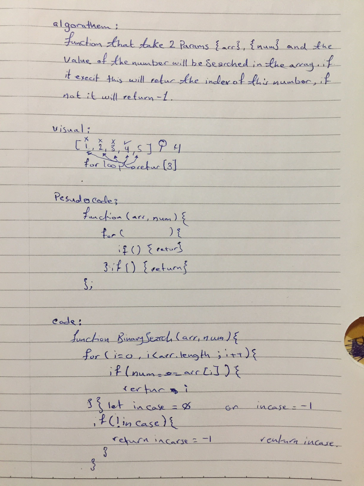

# Array Binary Search

Write a function that will find the number you want inside the array and it will return the index of this number.

## Challenge

the most challenging part was to figure out a way to loop in side the array without returning the value each time, only when it finds the target index.

## Approach & Efficiency

What I did is I wrote a function that takes two params , for loop to findout if its inside the array or not. if yes retun the index if not return -1 without using any built-in methods.

## Solution

