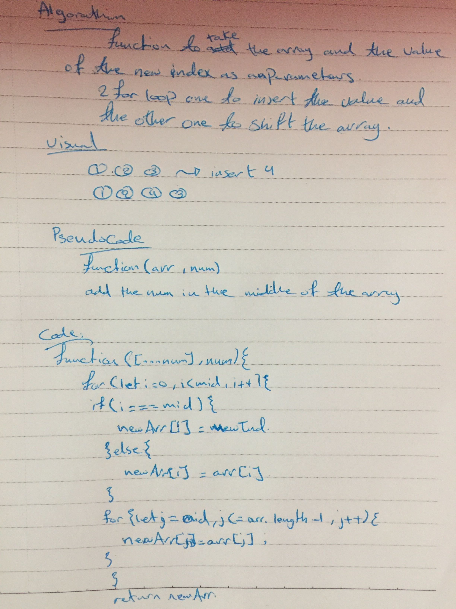

# Shifted an Array
Write a function that shift the order of any array with numbers or strings and inserts it into the middle of the array.

## Challenge
the challenge is to make a test without using any javaScript built-in functions.

## Approach & Efficiency
What I did is **decelared** an empty array , mid to get the **first two index** of the array and then we'll **adding** the the new index in the **middle** of the array without using any built-in methods.

## Solution
