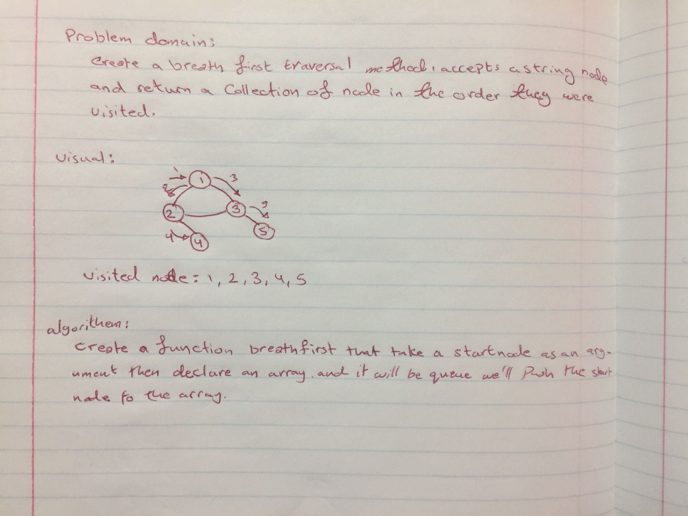

# Graph Breadth-First Traversal

## Challenge

Implement a Graph with  method:
1. `breadth-first traversal`

Extend your graph object with a breadth-first traversal method that accepts a starting node. Without utilizing any of the built-in methods available to your language, return a collection of nodes in the order they were visited. Display the collection.

## Approach & Efficiency

**Big O**:
space : O(n) 
time : O(n^2) 

## Solution

