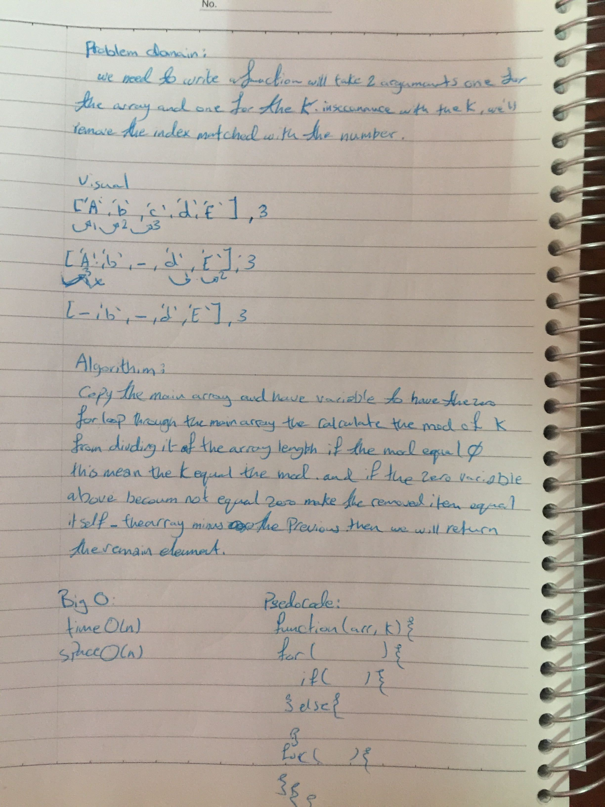

# Mock Interviews

Eeney Meeney Miney Moe function. Counting begins at a specified point in the circle and proceeds around the circle in a specified direction. After a specified number of index are skipped, the next index is removed. 

## Challenge

the most challenging part was to figure out a way to return the winner index

## Approach & Efficiency

What I did is I wrote a function that takes two params one for the array and one for the k, for loop with the givin array. the match index with the k will be removed

## Solution

