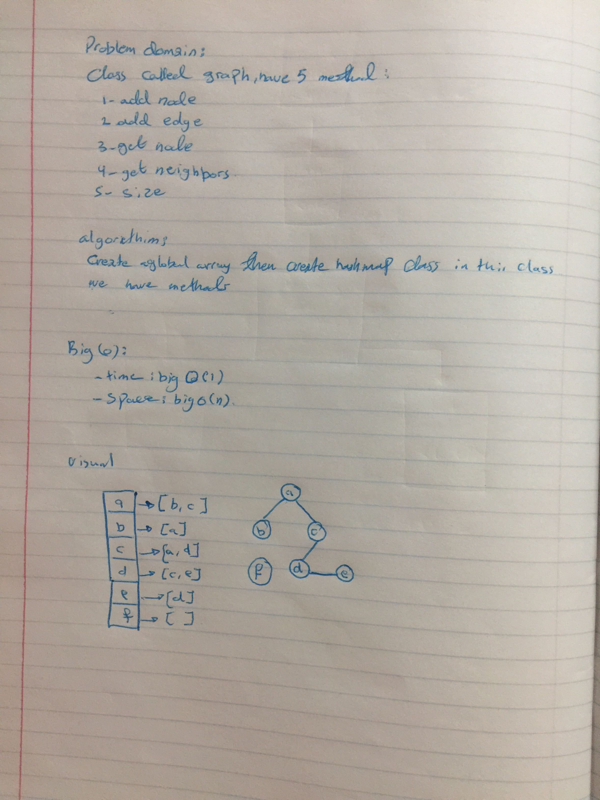

# Graph

## Challenge
Implement a Graph with the following methods:
1. `add node`
2. `add edge`
3. `get node`
4. `get neighbars`
5. `size`

## Challenge

- `AddNode()`
        Adds a new node to the graph
        Takes in the value of that node
        Returns the added node

- `AddEdge()`
        Adds a new edge between two nodes in the graph
        Include the ability to have a “weight”
        Takes in the two nodes to be connected by the edge
        Both nodes should already be in the Graph

- `GetNodes()`
        Returns all of the nodes in the graph as a collection (set, list, or similar)

- `GetNeighbors()`
        Returns a collection of edges connected to the given node
        Takes in a given node
        Include the weight of the connection in the returned collection

- `Size()`
        Returns the total number of nodes in the graph

## Approach & Efficiency

**Big O**:
- `AddNode`
    - space O(n) 
    - time O(1) 
    
- `AddEdge` 
    - space O(1) 
    - time O(1) 
    
- `GetNodes` 
    - space O(1) 
    - time O(n) 
    
- `GetNeighbors` 
    - space O(1) 
    - time O(1) 
    
- `Size` 
    - space O(1) 
    - time O(1)

## Solution

