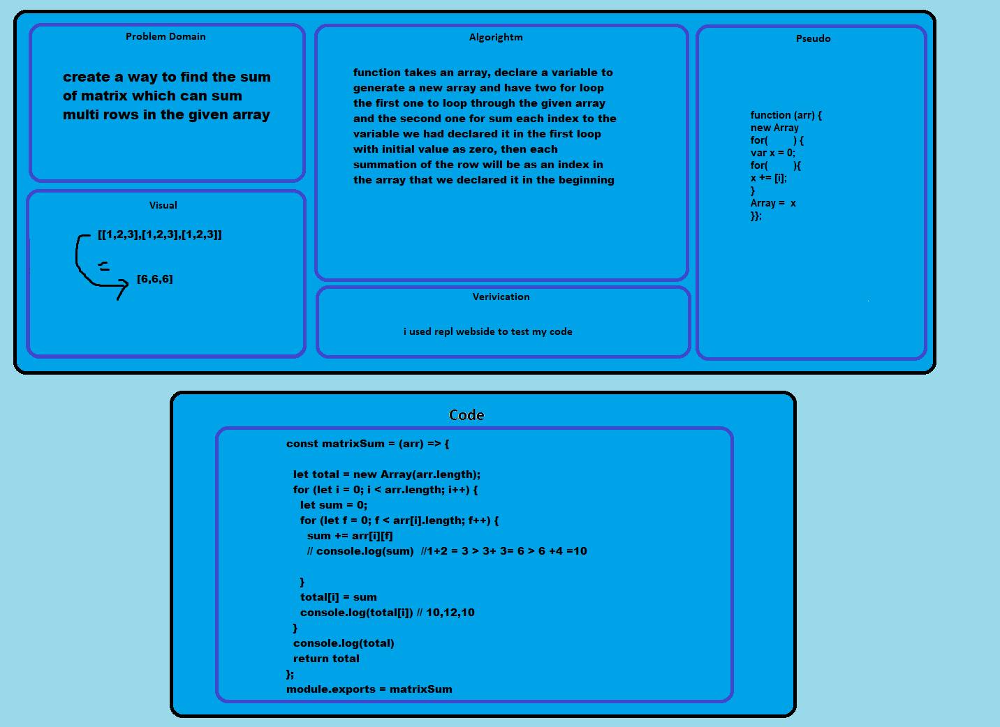

# Interview Question 
## Question 1

function to sum matrixs

## Challenge

the most challenging part was with doing the challenge without using methods like `map` & `forEach` .

## Approach & Efficiency

funtion with two for loop 

## Solution

