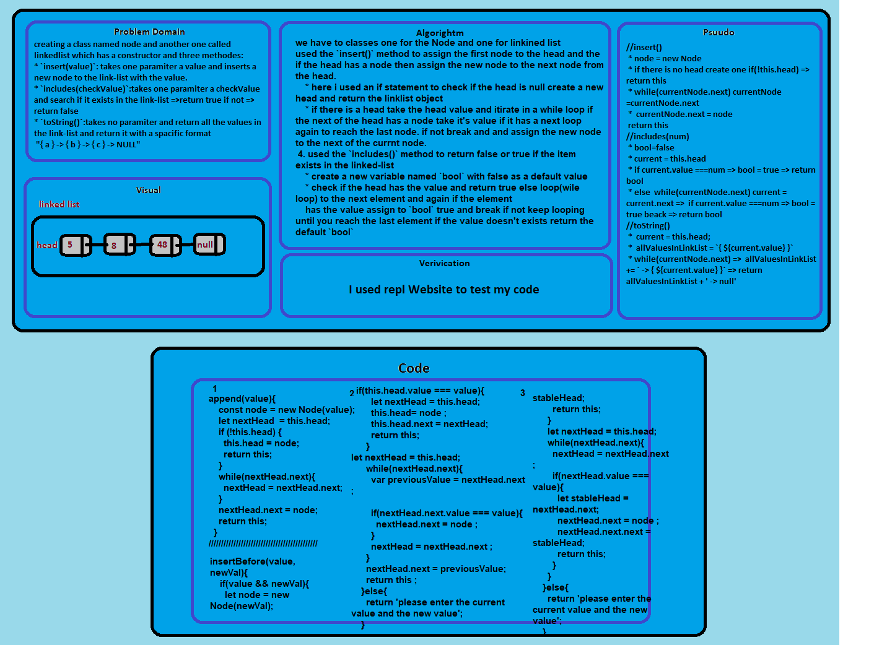

# Linked List

k-th value from the end of a linked list. 

## Challenge

the most challeng part was how to convert the value of node to an array!

## Approach & Efficiency

class constructor & while loop

### the Big O is Big O Of(n)

#### `insert(value)`
- time: Big O Of(1)
- space: Big O Of(2)

#### `append(value)`
- time: Big O Of(n)
- space: Big O Of(2)

#### `includes(value)`
- time: Big O Of(n)
- space: Big O Of(1)

#### `toString()`
- time: Big O Of(n)
- space: Big O Of(2)

#### `insertBefore(value,newValue)`
- time: Big O Of(n)
- space: Big O Of(3)

#### `insertAfter(value,newValue)`
- time: Big O Of(n)
- space: Big O Of(3)

## Solution

