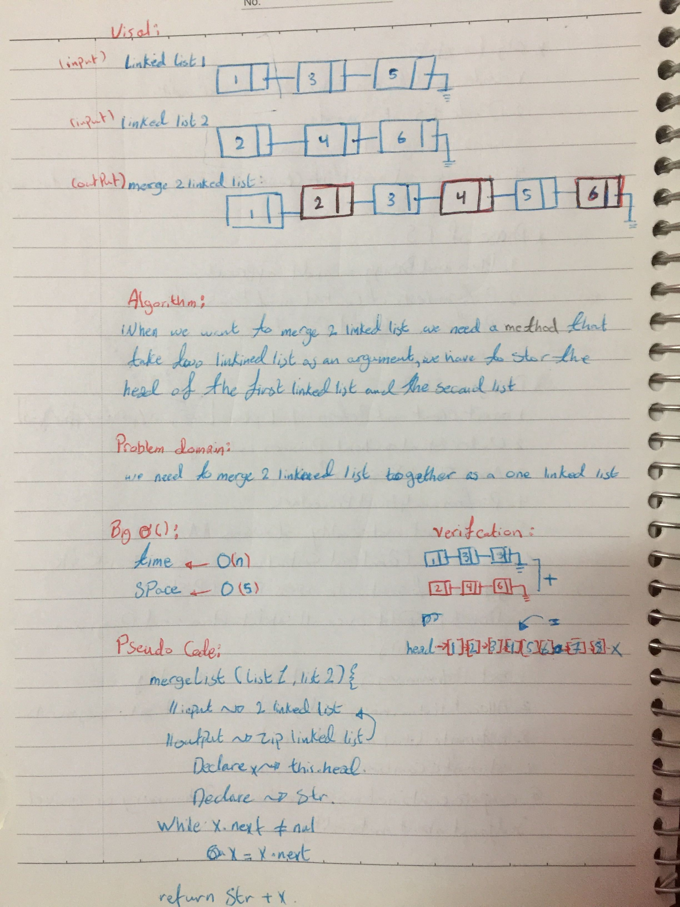

# Merge two linked lists.

merge two linked list in one linked list.

## Challenge
the challenge is to make a Zip the of two linked lists together into one so that the nodes alternate between the two lists and return a reference to the head of the zipped list.

## Approach & Efficiency
class constructor & while loop
What I did is **decelared** an a variable to save the first head value , then I used a while loop to loop through the linked list where ever the node had next then I return the value of the first head and the remain next of each value in a varible called str.

## Solution
