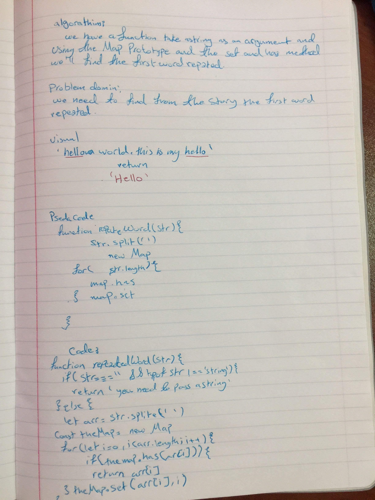

# Repeated word

## Challenge
Find the first repeated word in a book.

## Challenge
Without utilizing any of the built-in library methods available to your language, return the first word to occur more than once in that provided string

## Approach & Efficiency
I write a function that takes a long string as an argument and splite each word to make it as an array then I used the Map to iterates it and returns an array of [key, value] for each iteration.
and after this we looped through the the array with the has() method to indicate whether an element with the specified key exists or not. after that set() method adds the elements we got it from the has method and assigin to it  the value of the index.

## big(o)
space big O(n)
time big O(1)

## Solution

