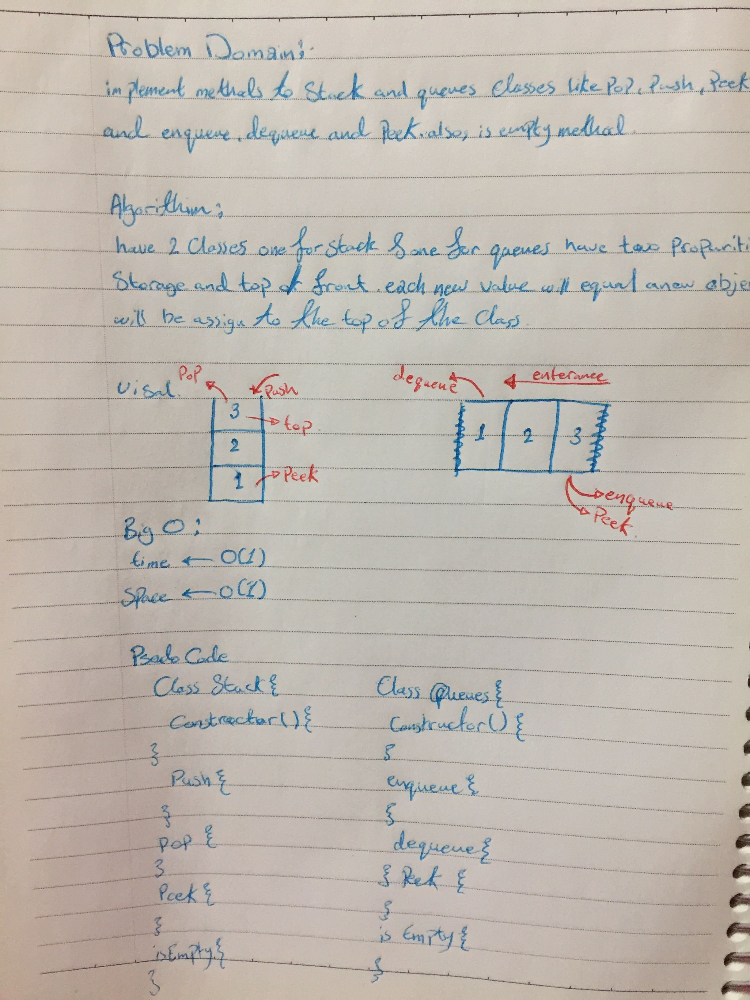

# Stack and a Queue Implementation

write three classes one for the Node one for the Stack and the last one for the queues.

## Challenge

the challenging part was with the `isEmpty` method because it wasn't in the the demo.

## Approach & Efficiency

- three class constructor 
- stack class methods
 - peek
 - push
 - pop
 - isEmpty
 
- queues class methods
 - peek
 - enqueue
 - dequeue
 - isEmpty

 ## Solution

