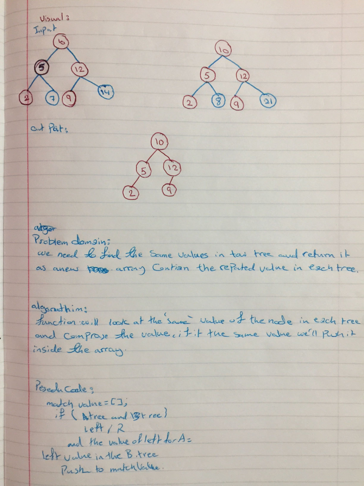

# Tree Intersection

## Challenge
Find common values in 2 binary trees

## Challenge
Write a function called `tree_intersection` that takes two binary tree parameters.
Without utilizing any of the built-in library methods available to your language, return a set of values found in both trees.

## Approach & Efficiency
preOrder() : Data => Left => Right => O(n) - need to iterate over all node and giit the value of it .

## big(o)
space big O(n)
time big O(1)

## Solution

